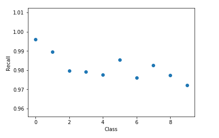
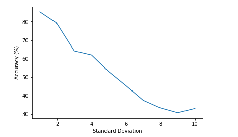
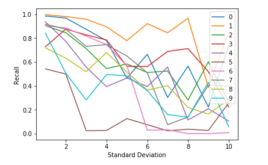
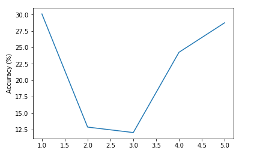

#Arterys Challenge
##Files Overview
* mnist.py: Contains the CNN model
* data_utils.py: Contains code for data preprocessing
* run.ipynb: IPython notebook with experiments for this coding challenge

##Model Overview:
The model is adapted from LeNet5 with minor differences. 

*Note: Due to some issues with my virtualenv I did all my testing on a Theano backend. However, it should still work with TensorFlow backend as well.*

##Part 1: Analysis on original data

**Q: What is your test set error rate?**

A: Test error rate: 0.0185

**Q: What is the test set error rate for each class? Are some classes more challenging than others to distinguish from each other? Why?**

A: The following is the recall score per class: 

[ 0.99591837  0.98942731  0.97965116  0.97920792  0.97759674  0.9854260  0.97599165  0.98249027  0.97741273  0.97224975]

It is evident that classes 2, 3, 4, 6, 8, 9 are slightly more challenging compared to the rest. This could be due to ambiguity due to handwriting (for example: some times 4 and 6 look alike), noise in images and bad clarity of the image scan. 

**Q: Based only on information gathered in the first epoch of training, do you think that the model would benefit from more training time? Why?**

A: I would run it for at least a couple more epochs to see if I can obtain any improvement in validation accuracy . Its impossible to judge from one epoch alone. Generally, more training will surely be useful. However, for a dataset like MNIST, we can say it is "good enough" with about 99% accuracy unless we are trying to break some record. 

**Q: Besides training for a longer time, what would you do to improve accuracy?.**

A: Increasing width of each layer, adding more convolution layers (adding a second convolution layer in my model gave me ~1% jump in accuracy) and fully connected layers, try different optimizers (adam gave me better accuracy than adagrad), vary sizes of filters etc.

##Part 2: Analysis on noisy data

**Q: What are the implications of the dependence of accuracy on noise if you were to deploy a production classifier? How much noise do you think a production classifier could tolerate?**

A: From the graph below, it is clear that accuracy decreases almost linearly with increase in standard deviation. Given that in a production system, there could be other types of noise, it can be safely assumed that a noise levels with a standard deviation of 8 is totally unacceptable. A std deviation less than 2, which gives an accuracy greater than 80%, is the most acceptable in my opinion 

**Q: Do you think that Gaussian noise is an appropriate model for real-world noise if the characters were acquired by standard digital photography? If so, in what situations? How would you compensate for it?**

A: Yes. Most common sources of noise is variation in illumination. This follows a Gaussian distribution. Gaussian noise can also creep in due to high camera temperature and amplification of certain channels in the image. A possible way to compensate for it is to preprocess the images by smoothing the image with a Gaussian filter. It should also be noted that the convolution layers **can** learn to smooth  the image.  

**Q: Is the accuracy of certain classes affected more by image noise than others? Why?**

A: From the graph below, it is evident that "1" is the most robust to noise and "5" is the least robust to noise followed by "9", "4', "7", "8". It is pretty logical to expect this behavior for "9" given that "9" was the hardest to recognize even without noise. Adding noise distorts the digit and some time occludes portions of it, making it look like other number numbers. With very high noise levels (std deviation > 4), the image is almost unrecognizable and I assume that the network is learning some patterns in the noisy images that is not recognizable to the human eye. 

##Part 3: Analysis on noisy labels

**Q: How important are accurate training labels to classifier accuracy?**

A: The following graph shows the effect of label noise (5% of training data having random labels) for 5 different initializations. It is evident that label noise (even for just 5% of the data) adversly affects classification accuracy. 

**Q: How would you compensate for label noise? Assume you have a large budget available but you want to use it as efficiently as possible.**

A: Possible ways to handle label noise:
* If we know which portion of data has noisy labels, we can exclude it from our training altogether
* Say we know what percentage (for ex: 10%) of our labels are noisy but do not know which ones, we can split our training data k-fold (like what we do for cross validation) (if 10% is noisy, k=10) and train on different portions of the data (leaving out 1 fold each time). The training set that gives us the best accuracy can be kept and the rest discarded.
* If we do not know the percentage of labels that are noisy, we will have to split the data with varying values of k and use the value that gives us the best accuracy.
* If the noisy labels are randomly spread across the dataset, we can pick data randomly for training. However this may not be feasible given that it is not deterministic. 
* Adding some sort of Label smoothing
  - Label smoothing to predictions (modifying loss function)
  - Label smoothing to ground truth - https://arxiv.org/pdf/1512.00567.pdf
*Note: I must admit, I have not tried handling noisy labels myself. There seems to be a lot of research to handle this problem. This above point is through cursory reading only. *

**Q: How would you quantify the amount of label noise if you had a noisy data set?**

**Q: If your real-world data had both image noise and label noise, which would you be more concerned about? Which is easier to compensate for?**
